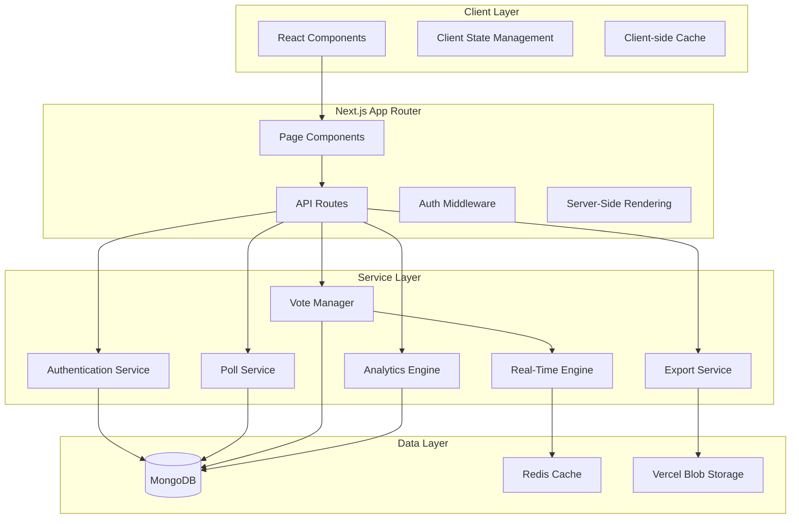
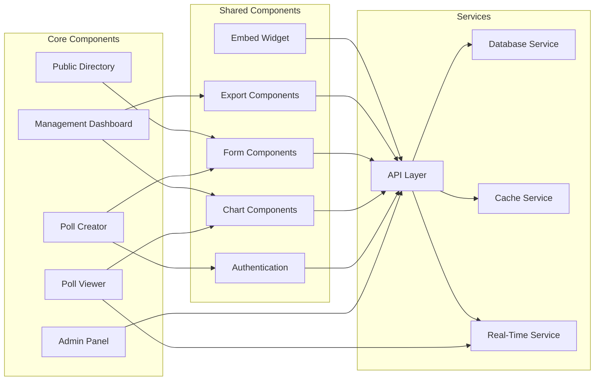

# Design Document: PulsePoll Platform

## Overview

PulsePoll is a comprehensive web-based polling and survey platform built with Next.js App Router, MongoDB, and Tailwind CSS. The platform enables users to create, share, and analyze polls in real-time with enterprise-grade performance and security.

### Core Features
- Multi-type poll creation (single choice, multiple choice, ranking, yes/no, survey)
- Real-time results with live updates
- Comprehensive duplicate vote prevention
- Advanced analytics and data export
- Public poll discovery directory
- Administrative controls and moderation
- Responsive design with embed capabilities

### Technology Stack
- **Frontend/Backend**: Next.js 14 App Router (full-stack)
- **Database**: MongoDB with Mongoose ODM
- **Authentication**: NextAuth.js (Auth.js)
- **Styling**: Tailwind CSS
- **Real-time**: Server-Sent Events (SSE) / WebSockets
- **Deployment**: Vercel
- **File Storage**: Vercel Blob (for exports)

## Architecture

### System Architecture

The PulsePoll platform follows a modern full-stack architecture leveraging Next.js App Router for both client and server-side functionality:



### Component Architecture

The application is structured using a modular component architecture:



## Components and Interfaces

### Authentication Service

Handles user registration, login, session management, and authorization using NextAuth.js.

**Interface:**
```typescript
interface AuthenticationService {
  register(email: string, password: string): Promise<User>
  login(email: string, password: string): Promise<Session>
  logout(sessionId: string): Promise<void>
  resetPassword(email: string): Promise<void>
  validateSession(token: string): Promise<User | null>
  hashPassword(password: string): Promise<string>
  verifyPassword(password: string, hash: string): Promise<boolean>
}

interface User {
  id: string
  email: string
  emailVerified: boolean
  createdAt: Date
  role: 'user' | 'admin'
}
```

### Poll Service

Manages poll creation, configuration, and lifecycle operations.

**Interface:**
```typescript
interface PollService {
  createPoll(config: PollConfig, creatorId: string): Promise<Poll>
  updatePoll(pollId: string, updates: Partial<PollConfig>): Promise<Poll>
  deletePoll(pollId: string, userId: string): Promise<void>
  getPoll(pollId: string): Promise<Poll | null>
  getUserPolls(userId: string, filters?: PollFilters): Promise<Poll[]>
  getPublicPolls(filters?: PublicPollFilters): Promise<Poll[]>
  duplicatePoll(pollId: string, userId: string): Promise<Poll>
}

interface PollConfig {
  title: string
  description?: string
  type: 'single' | 'multiple' | 'ranking' | 'yesno' | 'survey'
  options: PollOption[]
  privacy: 'public' | 'unlisted' | 'private'
  expiresAt?: Date
  maxVotes?: number
  allowAnonymous: boolean
}
```

### Vote Manager

Processes votes with comprehensive duplicate prevention mechanisms.

**Interface:**
```typescript
interface VoteManager {
  castVote(pollId: string, vote: VoteData, voter: VoterInfo): Promise<VoteResult>
  validateVote(pollId: string, vote: VoteData): Promise<ValidationResult>
  checkDuplicate(pollId: string, voter: VoterInfo): Promise<boolean>
  getVoteCount(pollId: string): Promise<number>
  getVotesByPoll(pollId: string): Promise<Vote[]>
}

interface VoterInfo {
  userId?: string
  ipAddress: string
  userAgent: string
  fingerprint: string
  sessionId: string
}

interface DuplicatePreventionSystem {
  checkIPDuplicate(pollId: string, ip: string): Promise<boolean>
  checkSessionDuplicate(pollId: string, sessionId: string): Promise<boolean>
  checkUserDuplicate(pollId: string, userId: string): Promise<boolean>
  checkFingerprintDuplicate(pollId: string, fingerprint: string): Promise<boolean>
  recordVote(pollId: string, voter: VoterInfo): Promise<void>
}
```

### Analytics Engine

Processes and presents poll analytics data with real-time capabilities.

**Interface:**
```typescript
interface AnalyticsEngine {
  getPollResults(pollId: string): Promise<PollResults>
  getVotingTimeline(pollId: string): Promise<TimelineData[]>
  getVoterDemographics(pollId: string): Promise<Demographics>
  getReferralSources(pollId: string): Promise<ReferralData[]>
  getSystemMetrics(): Promise<SystemMetrics>
  generateReport(pollId: string, format: 'summary' | 'detailed'): Promise<Report>
}

interface PollResults {
  totalVotes: number
  uniqueVoters: number
  optionResults: OptionResult[]
  lastUpdated: Date
}
```

### Real-Time Engine

Provides live updates for poll results using Server-Sent Events.

**Interface:**
```typescript
interface RealTimeEngine {
  subscribeToUpdates(pollId: string, clientId: string): EventSource
  broadcastUpdate(pollId: string, update: PollUpdate): Promise<void>
  getActiveConnections(pollId: string): number
  cleanupConnections(): Promise<void>
}

interface PollUpdate {
  type: 'vote' | 'result' | 'status'
  pollId: string
  data: any
  timestamp: Date
}
```

### Export Service

Handles data export functionality in multiple formats.

**Interface:**
```typescript
interface ExportService {
  exportToCSV(pollId: string): Promise<string>
  exportToExcel(pollId: string): Promise<Buffer>
  exportToJSON(pollId: string): Promise<object>
  generateDownloadLink(pollId: string, format: ExportFormat): Promise<string>
  scheduleExport(pollId: string, format: ExportFormat, email: string): Promise<void>
}

type ExportFormat = 'csv' | 'excel' | 'json'
```

## Data Models

### Database Schema Design

The MongoDB database uses the following collection structure:

#### Users Collection
```typescript
interface UserDocument {
  _id: ObjectId
  email: string
  passwordHash: string
  emailVerified: boolean
  role: 'user' | 'admin'
  createdAt: Date
  updatedAt: Date
  lastLoginAt?: Date
  profile: {
    name?: string
    avatar?: string
  }
}
```

#### Polls Collection
```typescript
interface PollDocument {
  _id: ObjectId
  title: string
  description?: string
  type: 'single' | 'multiple' | 'ranking' | 'yesno' | 'survey'
  options: PollOption[]
  privacy: 'public' | 'unlisted' | 'private'
  creatorId: ObjectId
  status: 'draft' | 'active' | 'expired' | 'closed'
  settings: {
    allowAnonymous: boolean
    requireCaptcha: boolean
    expiresAt?: Date
    maxVotes?: number
  }
  metadata: {
    createdAt: Date
    updatedAt: Date
    publishedAt?: Date
    totalVotes: number
    uniqueVoters: number
    viewCount: number
  }
  analytics: {
    referralSources: Map<string, number>
    deviceTypes: Map<string, number>
    locations: Map<string, number>
  }
}

interface PollOption {
  id: string
  text: string
  description?: string
  imageUrl?: string
  voteCount: number
}
```

#### Votes Collection
```typescript
interface VoteDocument {
  _id: ObjectId
  pollId: ObjectId
  voterId?: ObjectId  // null for anonymous votes
  voterInfo: {
    ipAddress: string
    userAgent: string
    fingerprint: string
    sessionId: string
    location?: {
      country: string
      region: string
      city: string
    }
  }
  voteData: {
    selectedOptions: string[]  // option IDs
    rankings?: { [optionId: string]: number }
    textResponses?: { [questionId: string]: string }
  }
  createdAt: Date
  referralSource?: string
}
```

#### Sessions Collection (for duplicate prevention)
```typescript
interface SessionDocument {
  _id: ObjectId
  pollId: ObjectId
  sessionId: string
  ipAddress: string
  fingerprint: string
  userId?: ObjectId
  createdAt: Date
  expiresAt: Date
}
```

#### Exports Collection
```typescript
interface ExportDocument {
  _id: ObjectId
  pollId: ObjectId
  userId: ObjectId
  format: 'csv' | 'excel' | 'json'
  status: 'pending' | 'processing' | 'completed' | 'failed'
  downloadUrl?: string
  createdAt: Date
  completedAt?: Date
  expiresAt: Date
}
```

### Database Indexes

Critical indexes for performance:

```javascript
// Users
db.users.createIndex({ email: 1 }, { unique: true })
db.users.createIndex({ createdAt: -1 })

// Polls
db.polls.createIndex({ creatorId: 1, createdAt: -1 })
db.polls.createIndex({ privacy: 1, status: 1, createdAt: -1 })
db.polls.createIndex({ "metadata.totalVotes": -1 })
db.polls.createIndex({ "settings.expiresAt": 1 })

// Votes
db.votes.createIndex({ pollId: 1, createdAt: -1 })
db.votes.createIndex({ pollId: 1, "voterInfo.ipAddress": 1 })
db.votes.createIndex({ pollId: 1, "voterInfo.sessionId": 1 })
db.votes.createIndex({ pollId: 1, voterId: 1 })
db.votes.createIndex({ pollId: 1, "voterInfo.fingerprint": 1 })

// Sessions
db.sessions.createIndex({ pollId: 1, sessionId: 1 }, { unique: true })
db.sessions.createIndex({ pollId: 1, ipAddress: 1 })
db.sessions.createIndex({ expiresAt: 1 }, { expireAfterSeconds: 0 })
```
## Correctness Properties

*A property is a characteristic or behavior that should hold true across all valid executions of a system-essentially, a formal statement about what the system should do. Properties serve as the bridge between human-readable specifications and machine-verifiable correctness guarantees.*

### Property 1: User Registration Success
*For any* valid email and password combination, user registration should succeed and create a user account that can subsequently authenticate.
**Validates: Requirements 1.1, 1.3**

### Property 2: Email Validation Enforcement
*For any* email string, the authentication service should accept it for registration if and only if it matches valid email format patterns.
**Validates: Requirements 1.2**

### Property 3: Invalid Login Rejection
*For any* invalid credential combination (wrong email or password), login attempts should be rejected with appropriate error messages.
**Validates: Requirements 1.4**

### Property 4: Password Reset Token Generation
*For any* valid user account, requesting password reset should generate a valid reset token that can be used to update the password.
**Validates: Requirements 1.5**

### Property 5: Anonymous Voting Capability
*For any* public poll, anonymous users should be able to cast votes without requiring authentication.
**Validates: Requirements 1.6**

### Property 6: User Permission Differentiation
*For any* system action, the available capabilities should differ between anonymous and registered users according to their permission levels.
**Validates: Requirements 1.7**

### Property 7: Poll Type Support
*For any* supported poll type (single, multiple, ranking, yesno, survey), registered users should be able to create polls of that type successfully.
**Validates: Requirements 2.1, 2.2, 2.3, 2.4, 2.5**

### Property 8: Poll Creation Validation
*For any* poll creation attempt, the system should reject polls without titles or choice-based polls with fewer than 2 options.
**Validates: Requirements 2.6**

### Property 9: Description Length Enforcement
*For any* poll description, the system should accept descriptions up to 500 characters and reject longer ones.
**Validates: Requirements 2.7**

### Property 10: Privacy Setting Support
*For any* privacy setting (public, unlisted, private), polls should be created with the specified privacy level and behave accordingly.
**Validates: Requirements 2.8**

### Property 11: Expiration Configuration
*For any* valid expiration date or vote limit, polls should be created with the specified expiration settings and enforce them correctly.
**Validates: Requirements 2.9, 2.10**

### Property 12: Unique Poll Identification
*For any* created poll, the database should assign a unique identifier that distinguishes it from all other polls.
**Validates: Requirements 2.11**

### Property 13: Vote Recording
*For any* valid vote on an active poll, the vote should be recorded in the database and reflected in poll results.
**Validates: Requirements 3.1**

### Property 14: IP Duplicate Prevention
*For any* IP address, only one vote per poll should be accepted within a 24-hour period, with subsequent attempts rejected.
**Validates: Requirements 3.2**

### Property 15: Session Duplicate Prevention
*For any* browser session, only one vote per poll should be accepted, with subsequent attempts from the same session rejected.
**Validates: Requirements 3.3**

### Property 16: User Account Duplicate Prevention
*For any* authenticated user, only one vote per poll should be accepted from their account, with subsequent attempts rejected.
**Validates: Requirements 3.4**

### Property 17: Fingerprint Duplicate Prevention
*For any* device fingerprint, only one vote per poll should be accepted, with subsequent attempts from the same fingerprint rejected.
**Validates: Requirements 3.5**

### Property 18: Duplicate Vote Error Handling
*For any* duplicate vote attempt, the system should reject the vote and return a descriptive error message explaining why it was rejected.
**Validates: Requirements 3.6**

### Property 19: Real-time Result Updates
*For any* vote cast on a poll, the poll results should be updated immediately and reflected in real-time displays.
**Validates: Requirements 3.8**

### Property 20: Chart Type Mapping
*For any* poll type, the results should be displayed using the appropriate chart format (pie for single choice, bar for multiple choice, ranked list for ranking).
**Validates: Requirements 4.1, 4.2, 4.3**

### Property 21: Percentage Calculation Accuracy
*For any* set of votes on a poll, the displayed percentages should accurately reflect the proportion of votes for each option, totaling 100%.
**Validates: Requirements 4.4**

### Property 22: Vote Count Accuracy
*For any* poll option, the displayed vote count should exactly match the number of votes recorded for that option.
**Validates: Requirements 4.5**

### Property 23: Total Vote Tracking
*For any* poll, the analytics engine should maintain an accurate count of total votes that matches the sum of all individual votes.
**Validates: Requirements 4.7**

### Property 24: Unique Voter Counting
*For any* poll, the unique voter count should accurately reflect the number of distinct voting sources, accounting for duplicate prevention rules.
**Validates: Requirements 4.8**

### Property 25: Timeline Data Recording
*For any* vote cast, the system should record timestamp information that enables accurate voting timeline analysis.
**Validates: Requirements 4.9**

### Property 26: Location Data Tracking
*For any* vote with available geographic data, the location information should be recorded and included in analytics.
**Validates: Requirements 4.10**

### Property 27: Device Type Statistics
*For any* vote, the device type information should be recorded and aggregated for analytics purposes.
**Validates: Requirements 4.11**

### Property 28: Unique Link Generation
*For any* created poll, the system should generate a unique shareable link that provides access to that specific poll.
**Validates: Requirements 5.1**

### Property 29: Social Media Link Generation
*For any* poll, the system should generate valid sharing links for major social media platforms that correctly reference the poll.
**Validates: Requirements 5.3**

### Property 30: QR Code Generation
*For any* poll link, the system should generate a valid QR code that, when scanned, directs to the correct poll.
**Validates: Requirements 5.4**

### Property 31: Embed Code Generation
*For any* poll, the system should generate valid iframe embed code that displays the poll correctly on external websites.
**Validates: Requirements 5.5**

### Property 32: Referral Source Tracking
*For any* poll access via shared link, the system should track and record the referral source for analytics.
**Validates: Requirements 5.8**

### Property 33: User Poll Dashboard
*For any* registered user, their dashboard should display all polls they have created, with accurate metadata and status information.
**Validates: Requirements 6.1**

### Property 34: Poll Sorting Functionality
*For any* set of user polls, the dashboard should correctly sort them by creation date, title, or vote count as requested.
**Validates: Requirements 6.2**

### Property 35: Poll Status Filtering
*For any* poll status filter (active, expired, draft), the dashboard should display only polls matching that status.
**Validates: Requirements 6.3**

### Property 36: Poll Editing Capability
*For any* active poll owned by a user, the system should allow editing and save changes correctly.
**Validates: Requirements 6.4**

### Property 37: Voting-Based Edit Restrictions
*For any* poll that has received votes, the system should restrict editing to non-critical fields only, preventing changes that would invalidate existing votes.
**Validates: Requirements 6.5**

### Property 38: Poll Deletion
*For any* poll owned by a user, the system should allow deletion and completely remove the poll and associated data.
**Validates: Requirements 6.6**

### Property 39: Poll Duplication
*For any* existing poll, the duplication function should create a new poll with identical configuration but separate identity.
**Validates: Requirements 6.7**

### Property 40: Poll Status Management
*For any* poll, authorized users should be able to manually activate or deactivate the poll, changing its status appropriately.
**Validates: Requirements 6.8**

### Property 41: Dashboard Metrics Display
*For any* poll in the dashboard, performance metrics should be calculated and displayed accurately based on current data.
**Validates: Requirements 6.9**

### Property 42: Export Format Generation
*For any* poll with data, the export service should generate valid files in CSV, Excel, and JSON formats containing all poll information.
**Validates: Requirements 7.1, 7.2, 7.3**

### Property 43: Export Data Completeness
*For any* poll export, the generated file should include vote timestamps, voter metadata (where available), and poll configuration details.
**Validates: Requirements 7.4, 7.5, 7.8**

### Property 44: Large Dataset Export Links
*For any* export request for large datasets, the system should generate secure download links for file retrieval.
**Validates: Requirements 7.7**

### Property 45: Public Poll Directory Listing
*For any* poll with public privacy setting, it should appear in the public directory and be discoverable by other users.
**Validates: Requirements 8.1**

### Property 46: Directory Search Functionality
*For any* search query in the public directory, results should include polls whose titles or descriptions match the search terms.
**Validates: Requirements 8.2**

### Property 47: Directory Filtering
*For any* filter criteria (category, creation date), the public directory should return only polls matching those criteria.
**Validates: Requirements 8.3**

### Property 48: Popularity Metrics Display
*For any* poll in the public directory, popularity metrics should be calculated and displayed accurately.
**Validates: Requirements 8.4**

### Property 49: Directory Pagination
*For any* large result set in the public directory, pagination should work correctly, displaying appropriate subsets of results.
**Validates: Requirements 8.5**

### Property 50: Privacy Setting Enforcement
*For any* poll with unlisted or private privacy settings, it should be excluded from public directory listings.
**Validates: Requirements 8.7, 8.8**

### Property 51: Admin Poll Moderation
*For any* administrator, the admin panel should provide capabilities to moderate, review, and remove polls as needed.
**Validates: Requirements 9.1, 9.2**

### Property 52: Admin User Management
*For any* administrator, the admin panel should provide capabilities to manage user accounts, including suspension and banning.
**Validates: Requirements 9.3, 9.4**

### Property 53: Platform Analytics Display
*For any* administrator, the admin panel should display accurate platform-wide analytics and performance metrics.
**Validates: Requirements 9.5, 9.6**

### Property 54: Administrative Audit Logging
*For any* administrative action performed, the system should create audit log entries that track what was done, when, and by whom.
**Validates: Requirements 9.7**

### Property 55: Bulk Operations Support
*For any* set of polls selected for bulk operations, the admin panel should perform the requested actions on all selected items.
**Validates: Requirements 9.8**

### Property 56: Caching Implementation
*For any* frequently accessed poll, the system should implement caching mechanisms that improve performance without affecting data accuracy.
**Validates: Requirements 10.6**

### Property 57: Database Indexing
*For any* database query, appropriate indexes should be in place to ensure optimal performance for common access patterns.
**Validates: Requirements 10.7**

### Property 58: Rate Limiting Enforcement
*For any* user or IP address, the system should enforce rate limits to prevent abuse, rejecting requests that exceed defined thresholds.
**Validates: Requirements 11.1**

### Property 59: Input Validation and Sanitization
*For any* user input, the system should validate format and sanitize content to prevent security vulnerabilities.
**Validates: Requirements 11.2**

### Property 60: Secure Password Hashing
*For any* user password, the authentication service should use secure hashing algorithms and never store passwords in plain text.
**Validates: Requirements 11.3**

### Property 61: CAPTCHA Implementation
*For any* suspicious voting pattern detected, the system should require CAPTCHA verification before allowing vote submission.
**Validates: Requirements 11.4**

### Property 62: Data Encryption
*For any* sensitive user data stored in the database, it should be encrypted to protect against unauthorized access.
**Validates: Requirements 11.5**

### Property 63: Security Event Logging
*For any* security-related event (failed logins, suspicious activity), the system should create log entries for monitoring and analysis.
**Validates: Requirements 11.6**

### Property 64: CSRF Protection
*For any* form submission, the system should require and validate CSRF tokens to prevent cross-site request forgery attacks.
**Validates: Requirements 11.7**

### Property 65: HTTPS Enforcement
*For any* communication with the system, HTTPS should be enforced to ensure encrypted data transmission.
**Validates: Requirements 11.8**

### Property 66: Configuration Parsing
*For any* valid poll configuration submitted, the parser should successfully convert it into a proper Poll object with all fields correctly mapped.
**Validates: Requirements 12.1**

### Property 67: Configuration Validation Error Handling
*For any* invalid poll configuration, the validator should return descriptive error messages that clearly explain what needs to be corrected.
**Validates: Requirements 12.2**

### Property 68: Title Length Validation
*For any* poll title, the validator should accept titles between 5 and 200 characters and reject titles outside this range.
**Validates: Requirements 12.3**

### Property 69: Option Count Validation
*For any* choice-based poll type, the validator should require at least 2 options and reject configurations with fewer options.
**Validates: Requirements 12.4**

### Property 70: Future Date Validation
*For any* expiration date provided, the validator should accept only dates in the future and reject past dates.
**Validates: Requirements 12.5**

### Property 71: Poll Serialization
*For any* Poll object, the serializer should convert it back into valid configuration format that matches the original structure.
**Validates: Requirements 12.6**

### Property 72: Configuration Round-trip Integrity
*For any* valid poll configuration, parsing then serializing then parsing again should produce an equivalent object, preserving all data integrity.
**Validates: Requirements 12.7**

## Error Handling

### Error Categories and Responses

The PulsePoll platform implements comprehensive error handling across all system components:

#### Authentication Errors
- **Invalid Credentials**: Return 401 with descriptive message
- **Account Not Found**: Return 404 with user-friendly message
- **Email Already Exists**: Return 409 with registration conflict message
- **Session Expired**: Return 401 with re-authentication prompt
- **Password Reset Token Invalid**: Return 400 with token error message

#### Poll Creation Errors
- **Validation Failures**: Return 400 with field-specific error messages
- **Insufficient Permissions**: Return 403 with permission error
- **Title Too Short/Long**: Return 400 with length requirements
- **Insufficient Options**: Return 400 with minimum option requirement
- **Invalid Expiration Date**: Return 400 with date validation message

#### Voting Errors
- **Poll Not Found**: Return 404 with poll availability message
- **Poll Expired**: Return 410 with expiration notice
- **Duplicate Vote**: Return 409 with duplicate prevention message
- **Invalid Vote Data**: Return 400 with vote format requirements
- **Poll Closed**: Return 403 with poll status message
- **Rate Limit Exceeded**: Return 429 with retry-after header

#### Data Export Errors
- **Export Too Large**: Return 413 with size limit information
- **Invalid Format**: Return 400 with supported format list
- **Export Generation Failed**: Return 500 with retry instructions
- **Insufficient Permissions**: Return 403 with access requirements

#### System Errors
- **Database Connection**: Return 503 with service unavailable message
- **Cache Unavailable**: Graceful degradation with performance warning
- **Real-time Service Down**: Continue with polling fallback
- **File Storage Error**: Return 507 with storage issue message

### Error Response Format

All API errors follow a consistent JSON structure:

```typescript
interface ErrorResponse {
  error: {
    code: string
    message: string
    details?: any
    timestamp: string
    requestId: string
  }
}
```

### Retry and Recovery Strategies

- **Transient Errors**: Implement exponential backoff for retries
- **Network Failures**: Client-side retry with circuit breaker pattern
- **Database Timeouts**: Connection pooling and query optimization
- **Real-time Disconnections**: Automatic reconnection with state recovery
- **Export Failures**: Queue-based retry system with email notification

## Testing Strategy

### Dual Testing Approach

The PulsePoll platform employs both unit testing and property-based testing for comprehensive coverage:

#### Unit Testing Focus
- **Specific Examples**: Test concrete scenarios and edge cases
- **Integration Points**: Verify component interactions and API contracts
- **Error Conditions**: Validate error handling and edge case behavior
- **UI Components**: Test user interface interactions and rendering
- **Authentication Flows**: Verify login, registration, and session management

#### Property-Based Testing Focus
- **Universal Properties**: Verify correctness across all possible inputs
- **Data Integrity**: Ensure data consistency through system operations
- **Business Rules**: Validate that business logic holds for all scenarios
- **Security Properties**: Test security measures across input variations
- **Performance Characteristics**: Verify system behavior under various loads

### Property-Based Testing Configuration

**Testing Library**: fast-check (for JavaScript/TypeScript)
**Test Configuration**:
- Minimum 100 iterations per property test
- Custom generators for domain-specific data types
- Shrinking enabled for minimal counterexample identification
- Seed-based reproducibility for debugging

**Test Tagging Format**:
Each property test must include a comment referencing its design document property:
```javascript
// Feature: pulsepoll-platform, Property 1: User Registration Success
```

### Test Categories

#### Authentication Tests
- Unit tests for login/logout flows, password validation, session management
- Property tests for user registration success, email validation, credential handling

#### Poll Management Tests  
- Unit tests for poll creation UI, dashboard interactions, specific poll types
- Property tests for poll configuration validation, data integrity, CRUD operations

#### Voting System Tests
- Unit tests for vote submission UI, result display, specific duplicate scenarios
- Property tests for duplicate prevention, vote recording, result accuracy

#### Analytics Tests
- Unit tests for chart rendering, export functionality, specific metric calculations
- Property tests for data aggregation accuracy, timeline tracking, export completeness

#### Security Tests
- Unit tests for specific attack scenarios, authentication edge cases
- Property tests for input validation, rate limiting, CSRF protection

#### Performance Tests
- Load testing for concurrent users, vote processing, database queries
- Property tests for caching behavior, query optimization, resource usage

### Test Data Management

**Test Database**: Separate MongoDB instance for testing
**Data Fixtures**: Predefined test data sets for consistent testing
**Data Cleanup**: Automated cleanup between test runs
**Mock Services**: External service mocking for isolated testing

### Continuous Integration

**Test Execution**: All tests run on every commit and pull request
**Coverage Requirements**: Minimum 80% code coverage for unit tests
**Property Test Integration**: Property tests included in CI pipeline
**Performance Benchmarks**: Automated performance regression detection